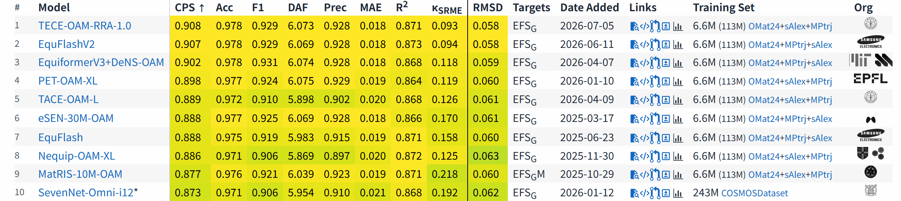

<!-- # TACE Foundational Models -->



# Note
The small models will be released soon.
TECE-OAM-RRA-1.0 is not the final version of OAM. 

# Available models

You should use TACE's acceleration methods to benchmark all TACE models:

[TACE Acceleration Guide](https://tace.readthedocs.io/en/latest/guide/acceleration.html)

The source code for TACE can be found here: [TACE GitHub Repository](https://github.com/xvzemin/tace).

All model can be found here: [TACE HuggingFace Repository](https://huggingface.co/xvzemin/tace-foundations/tree/main).

| Name                        | Level of theory | Available sizes     | To be used for                      | Training set          |
|-----------------------------|-----------------|---------------------|-------------------------------------|-----------------------|
| TECE-OAM-RRA-1.0            | PBE+U           | XL                  | materials (89 elements)             | OMat24 → sAlex+MPtrj  |
| TECE-OMat24-RRA             | PBE+U           | XL                  | materials (89 elements)             | OMat24                |
| TACE-OAM-RRA-Preview        | PBE+U           | XL                  | materials (89 elements)             | OMat24 → sAlex+MPtrj  |
| TACE-OMat24-RRA             | PBE+U           | XL                  | materials (89 elements)             | OMat24                |
| TACE-OMAT24                 | PBE+U           | L                   | materials (89 elements)             | OMat24                |
| TACE-OAM                    | PBE+U           | L                   | materials (89 elements)             | OMat24 → sAlex+MPtrj  |

---

# Legacy models
| Name                        | Level of theory | Available sizes     | To be used for                      | Training set          |
|-----------------------------|-----------------|---------------------|-------------------------------------|-----------------------|
| TACE-v1-OMAT24              | PBE+U           | M                   | materials (89 elements)             | OMat24                |
| TACE-v1-OAM                 | PBE+U           | M                   | materials (89 elements)             | OMat24 → sAlex+MPtrj  |
| TACE-v1-LES-REICO-5-PdAgCHO | PBE             | M                   | heterogeneous catalysis (5 elements)| REICO-5-PdAgCHO       |
---

## Finetuning Strategy

We currently support **LoRA** and **parameter-freezing** finetuning methods.

For more details, please refer to the TACE documentation: [TACE Docs](https://tace.readthedocs.io/en/latest/index.html)

---

## Citing TACE

If you use TACE code or foundational models in your work, please cite the following references.  
We sincerely acknowledge the contributions of all researchers who made the training datasets publicly available. 
Specific dataset citations for each model will be provided in future updates.

```bibtex
@article{xu2025tace,
  title={TACE: A unified Irreducible Cartesian Tensor Framework for Atomistic Machine Learning},
  author={Xu, Zemin and Xie, Wenbo and Xie, Daiqian and Hu, P},
  journal={arXiv preprint arXiv:2509.14961},
  year={2025}
}

@misc{xu2026cartesian3jframeworkmachinelearning,
      title={A Cartesian-3j Framework for Machine Learning Interatomic Potentials},
      author={Zemin Xu and Chenyu Wu and Wenbo Xie and P. Hu},
      year={2026},
      eprint={2512.16882},
      archivePrefix={arXiv},
      primaryClass={physics.chem-ph},
      url={https://arxiv.org/abs/2512.16882},
}
```

## License

Code: MIT License  

Models：CC BY 4.0


